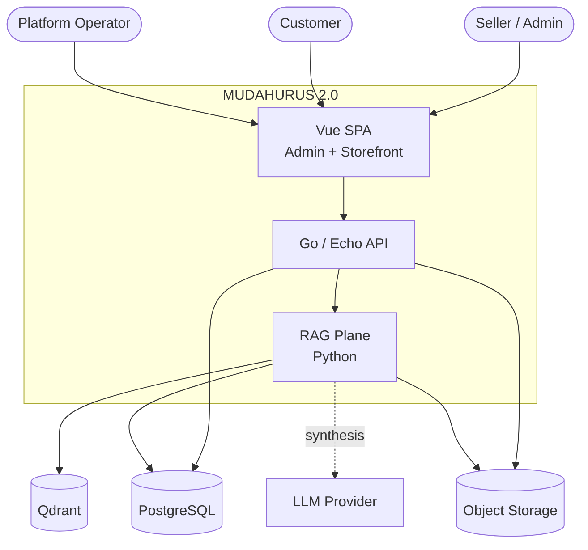
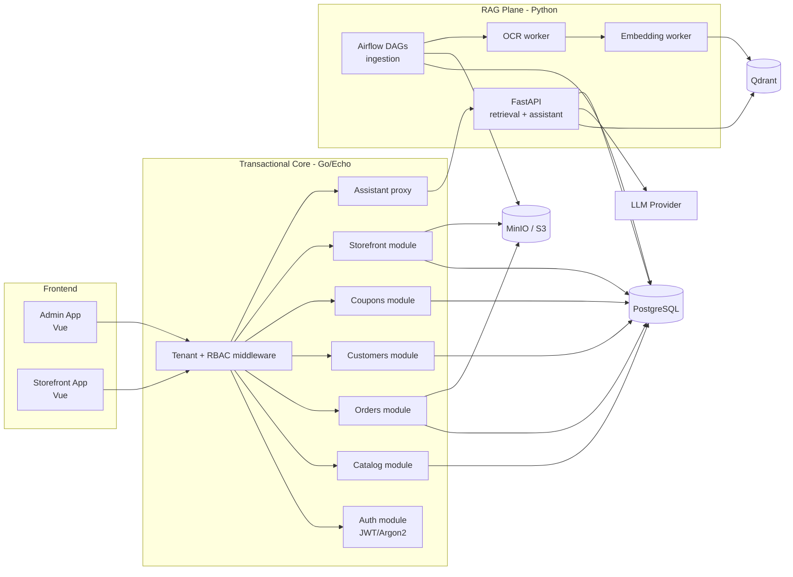
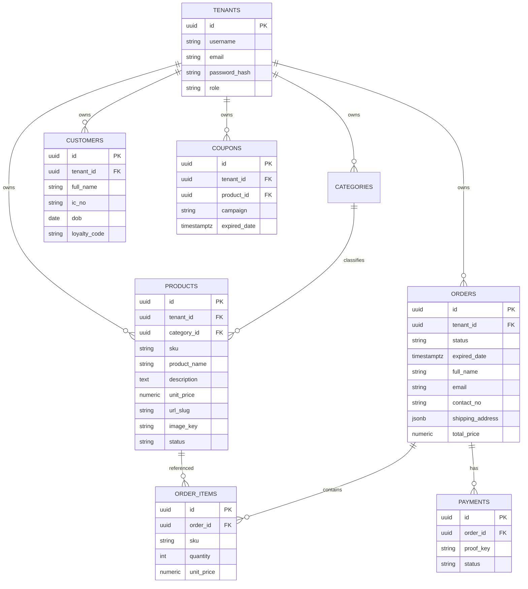
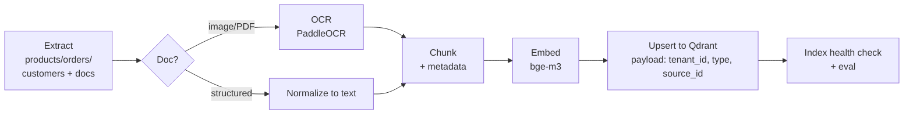
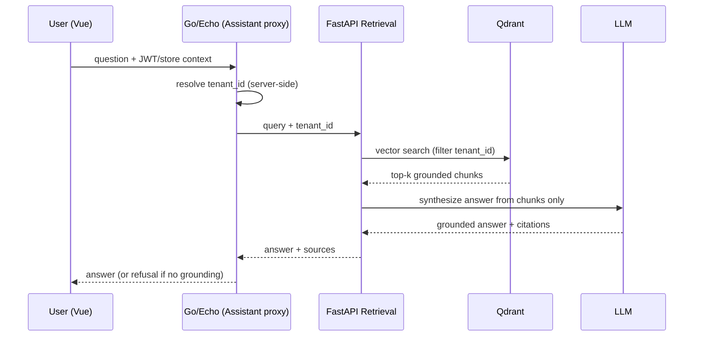
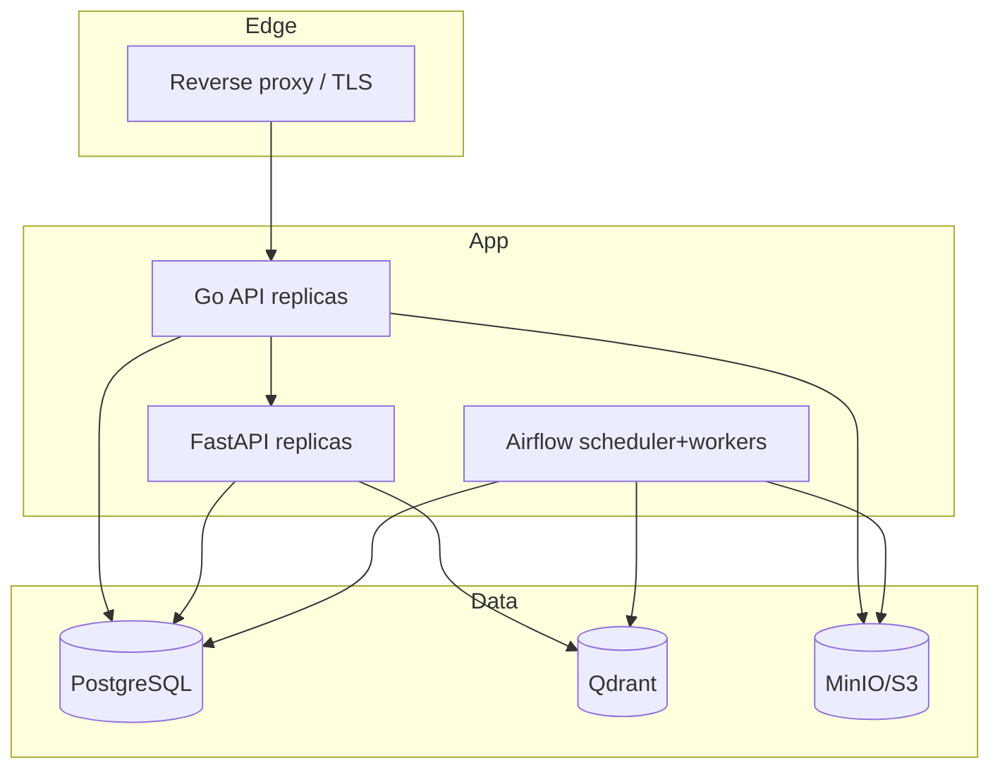

# MUDAHURUS 2.0 — Architecture

| | |
|---|---|
| **Document** | Architecture v1.0 |
| **Status** | Draft for approval |
| **Date** | 2026-05-31 |
| **Related** | [PRD.md](./PRD.md), [SPRINT_PLAN.md](./SPRINT_PLAN.md) |

---

## 1. Architectural Goals

- Replace the EOL CI3/PHP monolith with a **modular monolith** in Go (Echo) exposing a clean REST API to a **Vue SPA**.
- Introduce a **decoupled RAG plane** (Python) so AI/data-engineering iterates independently of the transactional core.
- Enforce **multi-tenancy** as a first-class, cross-cutting concern.
- Keep v1 deliberately small: transactional core + RAG foundation + one read-only assistant. No agent orchestration (deferred — see PRD §10).

## 2. Technology Stack

| Plane | Technology | Rationale |
|---|---|---|
| **Frontend** | Vue 3 (Composition API), Vite, Pinia, Vue Router, Tailwind | SPA for admin + storefront; fast, typed, component-driven |
| **Transactional API** | **Go 1.22+, Echo v4** | High-throughput, simple deploys (single binary), strong stdlib |
| **DB access** | `pgx` + `sqlc` (typed queries) + `golang-migrate` | Compile-time-safe SQL, parameterized by construction |
| **Database** | **PostgreSQL 16** | FKs, JSONB, full-text, robust; replaces MySQL |
| **Object storage** | S3-compatible (**MinIO** self-host / S3) | Product images, payment proofs, invoices; signed URLs |
| **Auth** | JWT (access+refresh), Argon2id | Replaces `ion_auth`; stateless, RBAC |
| **RAG ingestion** | **Python 3.12**, **Apache Airflow** (DAGs) | Scheduled/triggered ETL; mature orchestration |
| **OCR** | PaddleOCR / Tesseract | Extract text from payment proofs & invoices |
| **Embeddings** | sentence-transformers (e.g. `bge-m3`) — pluggable | Self-hostable, controls cost & PII exposure |
| **Vector store** | **Qdrant** | Tenant payload filters, hybrid search, fast |
| **Retrieval/Assistant API** | **FastAPI** | Serves grounded retrieval + read-only assistant to Go/Vue |
| **LLM** | Pluggable provider behind an interface | Grounding + answer synthesis; swappable |
| **Infra/Ops** | Docker, docker-compose (dev) / k8s (prod), GitHub Actions CI, Prometheus + Grafana, OpenTelemetry | Reproducible, observable |

> **Why Airflow vs. alternatives:** Airflow is the default for scheduled + backfill + dependency-managed ETL with good observability. If the team prefers lighter footprint, **Dagster** or **Prefect** are acceptable substitutes — the DAG contract (extract → OCR → chunk → embed → upsert) is framework-agnostic. Decision recorded in ADR-002.

## 3. System Context (C4 — Level 1)

## 4. Container View (C4 — Level 2)

## 5. Multi-Tenancy Model

- **Tenant key**: seller `tenant_id` (UUID, mapped from legacy `user_id`).
- **Transactional plane**: every domain table carries `tenant_id`; a Go middleware extracts it from the JWT and injects it into a request-scoped context. Repository layer **requires** `tenant_id` on every query (enforced via `sqlc` query design + a lint check). Optional defense-in-depth: PostgreSQL Row-Level Security.
- **Storefront (public)**: tenant resolved from `/store/{username}` → `tenant_id`; only `status='active'` products exposed; read-only.
- **RAG plane**: every Qdrant point stores `tenant_id` in payload; **all** searches apply a mandatory `tenant_id` filter injected server-side (never client-supplied). Per-tenant eval sets guard against leakage.

## 6. Data Architecture

### 6.1 Target Schema (PostgreSQL)

> **Note:** Legacy orders embed a single line item + shipping fields in one row. The target normalizes to `orders` + `order_items` + `payments`, while a migration view preserves the flat shape for parity testing.

### 6.2 Migration Strategy

1. **Profile** legacy MySQL (`mudahurus_*`, `users`, `general_logs`) for types/nulls/orphans.
2. **Transform** with a one-off Python job: map `user_id`→`tenant_id`, normalize orders, cleanse types.
3. **Load** into PostgreSQL; backfill object storage from legacy upload dirs.
4. **Reconcile**: row counts + checksums + spot checks; produce a reconciliation report.
5. **Cutover**: read-only freeze on legacy → final delta sync → switch DNS.

## 7. RAG Ingestion Pipeline (DAG Contract)

- **Triggers**: scheduled (e.g. hourly) + event-driven (on product/order create, on payment-proof upload) via a lightweight queue or Airflow API trigger.
- **Idempotency**: deterministic point IDs keyed on `(tenant_id, source_type, source_id, chunk_no)`; re-runs upsert, no duplicates.
- **PII policy**: customer IC/DOB excluded from embedded text by default; only retrievable fields are embedded.

## 8. Retrieval & Assistant (Read-Only, v1)

- **Guardrails**: tenant filter is injected by the proxy, never trusted from the client. Answers must be grounded in retrieved chunks; if retrieval is empty/low-confidence, the assistant **refuses** rather than free-generates. No tools, no writes.

## 9. Cross-Cutting Concerns

| Concern | Approach |
|---|---|
| **AuthN/Z** | JWT access (15m) + refresh (7d); RBAC roles `seller`, `operator`; storefront endpoints public read-only |
| **Validation** | Request DTO validation at handler boundary; reject on first error |
| **Secrets** | Env/secret manager; never in repo |
| **Files** | Signed upload/download URLs; content-type + size limits; AV scan hook (deferred to enhancement) |
| **Observability** | OTel traces across Go↔Python; Prometheus metrics; structured logs with `tenant_id`, `request_id` |
| **Errors** | Consistent JSON error envelope; no stack leakage to clients |
| **CI/CD** | GitHub Actions: lint, test, build, migrate-check, deploy staging→prod; rollback via image pin |

## 10. Deployment Topology

## 11. Architecture Decision Records (summary)

- **ADR-001**: Modular monolith in Go/Echo over microservices — fewer moving parts for a small team; split later if needed.
- **ADR-002**: Airflow for ingestion (Dagster/Prefect acceptable) — DAG contract is portable.
- **ADR-003**: PostgreSQL over staying on MySQL — better RAG/analytics fit, JSONB, RLS.
- **ADR-004**: RAG plane decoupled in Python — lets data/AI iterate without redeploying the transactional core.
- **ADR-005**: v1 assistant is read-only/grounded — defer agents/tools to enhancement roadmap to protect scope.

## 12. Scope Boundary (what this architecture does NOT include in v1)

Agent orchestration, write-capable copilots, autonomous fulfillment, notifications, recommendations — all deferred (PRD §10). The RAG plane is designed so these can be added later as additional services/consumers **without** re-architecting the core.
